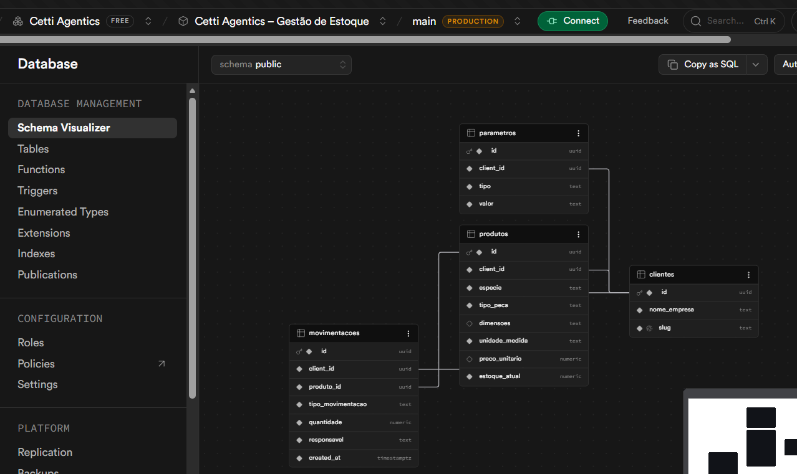

# Cetti - Gestão de Estoque (Streamlit + Supabase Data API)

Este repositório contém um app Streamlit que usa exclusivamente a Data API do Supabase (REST em `/rest/v1`) para leitura e escrita dos dados.

## Arquivos principais
- [app.py](app.py) - aplicação Streamlit
- [supabase_client.py](supabase_client.py) - helper de chamadas REST para a Data API do Supabase
- [requirements.txt](requirements.txt)

## Como rodar localmente

1. Criar um projeto no Supabase (ver seção abaixo).
2. Copiar `SUPABASE_URL` e `SUPABASE_KEY` (chave com permissão para acesso via Data API).
3. Exportar variáveis de ambiente localmente ou criar um arquivo `.env` com as chaves:

```
SUPABASE_URL=https://xyz.supabase.co
SUPABASE_KEY=eyJ....
APP_PASSWORD=minha_senha_mvp
```

4. Instalar dependências:

```bash
python -m pip install -r requirements.txt
```

5. Executar:

```bash
streamlit run app.py
```

## Fluxo do app

1. Login por senha (`APP_PASSWORD`).
2. Seleção de cliente carregada da tabela `clientes`.
3. Seleção de responsável com base nos últimos lançamentos da tabela `movimentacoes` (filtrados por `cliente_id`).
4. Dashboard de produtos filtrado por `cliente_id`.
5. Registro de movimentação atualizando `produtos.estoque_atual` e inserindo em `movimentacoes`.

## Configurar o Supabase (passos mínimos)

1. Crie um novo projeto em https://app.supabase.com
2. Abra SQL Editor e execute o script de estrutura do projeto:

```sql
-- scripts/script-create-tables.sql
```

3. Execute o seed de exemplo (opcional):

```sql
-- scripts/script-seed-exemplo1.sql
```

4. Obtenha `SUPABASE_URL` e `SUPABASE_KEY` em Settings → API.

## Deploy no Streamlit Cloud

1. Faça push do repositório para o GitHub.
2. No https://share.streamlit.io, conecte sua conta GitHub e crie um novo app apontando para este repo e branch.
3. Nas configurações do app (Secrets), adicione `SUPABASE_URL` e `SUPABASE_KEY` como segredos.
4. Configure o comando de execução (padrão) `streamlit run app.py` se necessário.

## Segurança

- Este MVP usa chave de API no backend do Streamlit para consumir a Data API.
- Não exponha a chave em frontend público.
- Se for evoluir para acesso direto do cliente final, revise autenticação e isolamento por tenant.

## Problemas comuns

- Se a tabela não aparece, confira se você executou o SQL no projeto correto.
- Em caso de erro 401/403, valide as chaves, permissões e o URL.

---

## Referências reais do projeto
- [Script para criar as tabelas do projeto](scripts/script-create-tables.sql)
    

